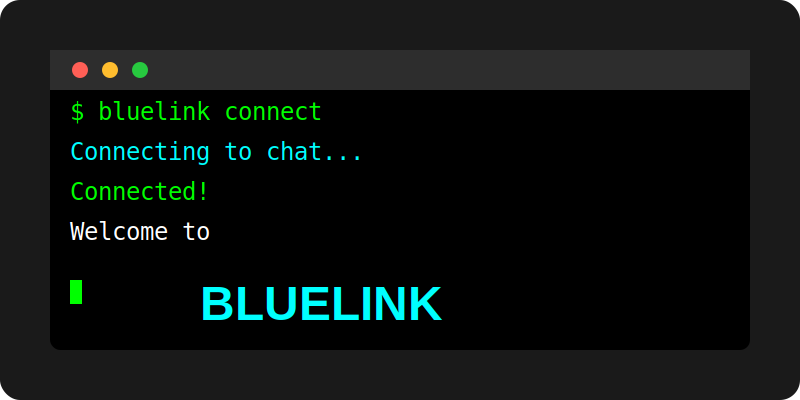

# BLUELINK

[](https://github.com/VrushankPatel/bluelink/actions/workflows/go.yml)
[](https://github.com/VrushankPatel)
[](https://github.com/VrushankPatel)
[](https://golang.org)
[](https://opensource.org/licenses/MIT)
[](https://upx.github.io)



A secure terminal-based chat application built with Go and Firebase Realtime Database.

## Features

- Create or join chat rooms via terminal
- Secure communication with Firebase backend
- Colored usernames for easy identification
- Real-time participant tracking
- Clean, intuitive terminal UI
- Cross-platform compatibility (Windows, macOS, Linux)
- Persistent user profiles
- Command-based interface for easy navigation
- Real-time typing indicators
- Activity status tracking for participants

## Architecture

Bluelink is built with a modular architecture using Go:

- **Config Module**: Handles user configuration and persistent storage
- **Firebase Module**: Manages all interactions with Firebase Realtime Database
- **UI Module**: Implements the terminal user interface using Bubble Tea
- **Main Module**: Coordinates application flow and handles command-line arguments

The application uses Firebase Realtime Database for:
- User presence management
- Real-time messaging
- Activity tracking
- Room persistence

### Real-time Updates Implementation

Bluelink uses a polling mechanism to provide real-time updates from Firebase:

- Messages are retrieved using Firebase queries with timestamp filtering
- Participant updates are monitored by tracking activity timestamps
- Regular polling intervals ensure timely updates (500ms for messages, 1s for participants)
- This approach provides compatibility with the Firebase Go Admin SDK while maintaining responsiveness

## CI/CD

The project uses GitHub Actions for continuous integration and delivery:

```yaml
# .github/workflows/go.yml
name: Go

on:
  push:
    branches: [ "master" ]
  pull_request:
    branches: [ "master" ]

jobs:
  build:
    runs-on: ubuntu-latest
    steps:
    - uses: actions/checkout@v4
    - name: Set up Go
      uses: actions/setup-go@v4
      with:
        go-version: '1.23.8'
    - name: Build
      run: go build -v ./...
    - name: Test
      run: go test -v ./...
```

## Installation

### Prerequisites

- Go 1.16 or later
- Firebase Project with Realtime Database enabled
- Terminal with Unicode support for best experience

### Setup Firebase

1. Create a Firebase project at [firebase.google.com](https://firebase.google.com)
2. Enable Realtime Database
   - Go to Build → Realtime Database
   - Create database in test mode initially
3. Set up service account credentials:
   - Go to Project Settings → Service Accounts
   - Select "Firebase Admin SDK"
   - Click "Generate new private key" (JSON format)
   - Save the JSON file securely
4. Configure Database Rules for security:
   ```json
   {
     "rules": {
       "rooms": {
         "$roomid": {
           ".read": true,
           ".write": true,
           "messages": {
             ".indexOn": "timestamp"
           },
           "participants": {
             ".indexOn": "lastActive"
           }
         }
       }
     }
   }
   ```

### Install Bluelink

#### From Source

```bash
# Clone the repository
git clone https://github.com/vrushank/bluelink.git
cd bluelink

# Build and install
go install ./cmd/bluelink
```

#### Using Go Install

```bash
go install github.com/vrushank/bluelink/cmd/bluelink@latest
```

#### Building a Binary

```bash
# Clone the repository
git clone https://github.com/vrushank/bluelink.git
cd bluelink

# Build for your platform
go build -o bluelink ./cmd/bluelink

# Move to a directory in your PATH (optional)
sudo mv bluelink /usr/local/bin/
```

## Configuration

Before using Bluelink, set up your Firebase credentials:

### Using Environment Variables (Recommended)

```bash
export FIREBASE_CREDENTIALS=/path/to/your-firebase-credentials.json
export FIREBASE_DATABASE_URL=https://your-project-id.firebaseio.com
```

Add these to your shell profile (`.bashrc`, `.zshrc`, etc.) for persistence.

### Using Local Configuration

Place your Firebase credentials in your current working directory as `firebase-credentials.json`.

### User Configuration

On first run, Bluelink will:
1. Ask for your name
2. Generate a unique user ID
3. Assign a persistent color for your messages
4. Store this information in `~/.bluelink/config.json`

## Usage

### Basic Commands

#### Create a New Chat Room

```bash
bluelink
```

This will generate a random 8-digit room ID and display it in the UI.

#### Join an Existing Chat Room

```bash
bluelink ROOM_ID
```

Replace `ROOM_ID` with the 8-digit room ID you want to join.

### In-chat Commands

- `/help` - Show available commands
- `/clear` - Clear chat history
- `/exit` - Leave the room

### Navigation

- `Tab` - Toggle between chat history and input area
- `Enter` - Send message
- `Ctrl+C` - Exit application

### UI Elements

The Bluelink interface consists of:
- Room header showing current room ID
- Main chat area with colored messages
- Participant list with activity status
- Input area for typing messages
- Help section (toggle with `/help`)

## Security Considerations

- All communication passes through Firebase Realtime Database
- User data is stored locally in `~/.bluelink/config.json`
- Room IDs are randomly generated 8-digit numbers
- Consider implementing end-to-end encryption for production use
- Set appropriate Firebase Database Rules for your use case

## Troubleshooting

### Connection Issues

If you're having trouble connecting to Firebase:

1. Verify your credentials file is correctly formatted
2. Check that `FIREBASE_DATABASE_URL` is set correctly
3. Ensure your Firebase project has Realtime Database enabled
4. Check your network connection and firewall settings

### UI Display Problems

For terminal display issues:

1. Ensure your terminal supports Unicode characters
2. Try adjusting your terminal window size
3. Check that your terminal supports ANSI color codes

### Build Issues

If you encounter build errors related to Firebase:

1. Ensure you're using a compatible Go version (1.16+)
2. The Firebase Go Admin SDK has some limitations regarding real-time listeners
3. Bluelink uses a polling mechanism for compatibility with all Firebase SDK versions

### Error Messages

Common error messages and solutions:

- "Firebase credentials not found": Set `FIREBASE_CREDENTIALS` environment variable or place `firebase-credentials.json` in your working directory
- "Room does not exist": Verify the room ID is correct and the room has not been deleted
- "Error initializing Firebase app": Check your credentials and database URL

## Development

### Project Structure

```
bluelink/
├── cmd/
│   └── bluelink/        # Main application
│       └── main.go
├── pkg/
│   ├── config/          # Configuration management
│   │   └── config.go
│   ├── firebase/        # Firebase integration
│   │   └── firebase.go
│   └── ui/              # Terminal UI
│       └── ui.go
├── .github/
│   └── workflows/       # CI/CD workflows
│       └── go.yml       # GitHub Actions workflow
├── go.mod               # Go module definition
├── go.sum               # Go module checksums
├── firebase-credentials.json  # Firebase credentials (example)
├── LICENSE              # MIT License
└── README.md            # This file
```

### Building From Source

```bash
# Clone the repository
git clone https://github.com/vrushank/bluelink.git
cd bluelink

# Install dependencies
go mod download

# Build
go build -o bluelink ./cmd/bluelink
```

### Running Tests

```bash
go test ./...
```

## Extending Bluelink

Possible extensions for the project:

- End-to-end encryption for messages
- File sharing capabilities
- Custom room names
- User authentication
- Message history retrieval
- Notification system
- Offline message caching

## License

This project is licensed under the MIT License - see the [LICENSE](LICENSE) file for details.

## Contributing

Contributions are welcome! Here's how you can contribute:

1. Fork the repository
2. Create a feature branch (`git checkout -b feature/amazing-feature`)
3. Commit your changes (`git commit -m 'Add some amazing feature'`)
4. Push to the branch (`git push origin feature/amazing-feature`)
5. Open a Pull Request

Please make sure to update tests as appropriate and follow the existing code style.

## Acknowledgments

- [Bubble Tea](https://github.com/charmbracelet/bubbletea) for the terminal UI framework
- [Firebase](https://firebase.google.com) for the real-time database